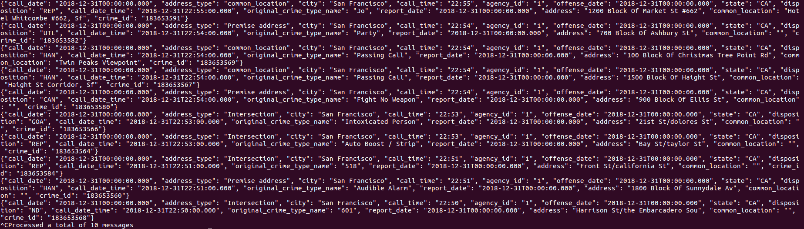
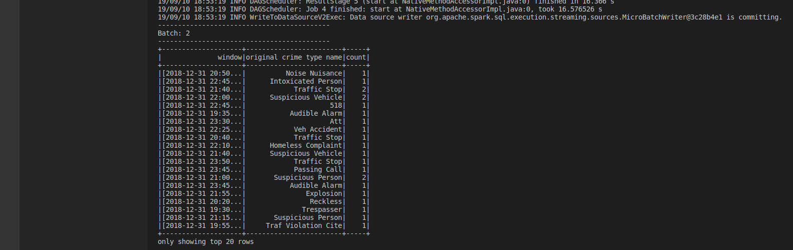

# SF Crime Statistics with Spark Streaming

In this project, you will be provided with a real-world dataset, extracted from Kaggle, on San Francisco crime incidents, and you will provide statistical analyses of the data using Apache Spark Structured Streaming. You will draw on the skills and knowledge you've learned in this course to create a Kafka server to produce data, and ingest data through Spark Structured Streaming.

### data_Producer.py
After running the following commands
```
bin/zookeeper-server-start.sh config/zookeeper.properties
bin/kafka-server-start.sh config/server.properties
```
```
bin/kafka-console-consumer.sh --bootstrap-server localhost:9092 --topic <your-topic-name> --from-beginning
```

We now lunch the producer_server.py and we should have this expected output


### Data streaming
Apache Spark already has an integration with Kafka Brokers, hence we will not need a separate Kafka Consumer.
Implement features in data_stream.py.
Do a spark-submit using this command:

```
 spark-submit --packages org.apache.spark:spark-sql-kafka-0-10_2.11:2.3.0 --master local[4] data_stream.py
``` 

This is what your output would look like



#### Note
Don't forget to initialize your environment variables,It will depend on your your files setup. It should look like this 
```
export SPARK_HOME=/Users/dev/spark-2.3.0-bin-hadoop2.7
```
### Data Source
Please I want to point out the fact that by the time I did this project the dataset provided by udacity(`AB_NYC_2019.csv`) in the resources panel did not match with the starter code. 

Actually the dataset that was given in the project resources had fields like `neighbourhood`, `room_type`, `minimum_nights`, `price` which had nothing to do with the project title itself :*SF Crime Statistics with Spark Streaming*. the fields instead had ties with something like a hotel.


In an attempt not to modify the starter code I checked on google for the dataset that was depicted in the starter code. Fortunately for me I found one that matched with the required fields. Below is the link to where I took the corresponding dataset: `https://www.kaggle.com/san-francisco/sf-police-calls-for-service-and-incidents/version/61`
Also, I had to shuffle the dataset in order to be able to work with it. I had to add underscores to some fields and changed from capital to small letters for example ;
```
Address type -> address_type

Report date -> report_date
```
All this to perfectly match the starter code.
